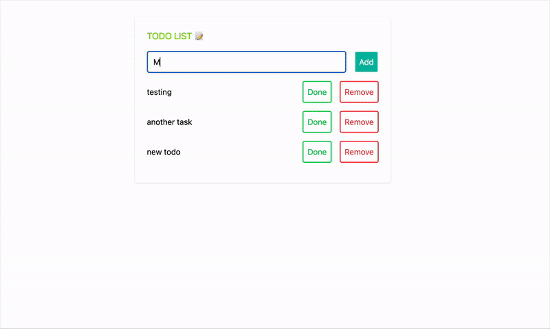

#### React + Nodejs todo list

This project is a small example of React + Nodejs + MongoDB todo list, everything is set up with a simple crud of
todo list and with docker integrated as well

### Development 

To run this project in development mode, you just need to run the following command:

```bash
  docker-compose -f docker-compose-dev.yml up --build -d
```

Any troubleshooting remove the images set up with the following command

```bash
  docker-compose -f docker-compose-dev.yml down -v
```

### Production mode

This project also supports production mode for production you can run the same command but without specifying the docker compose file in the root of the project

```bash
  docker-compose --build -d
```

Any troubleshooting remove the images set up with the following command
```bash
  docker-compose down -v
```


## 📽 DEMO

Here’s a quick look at the app in action:



